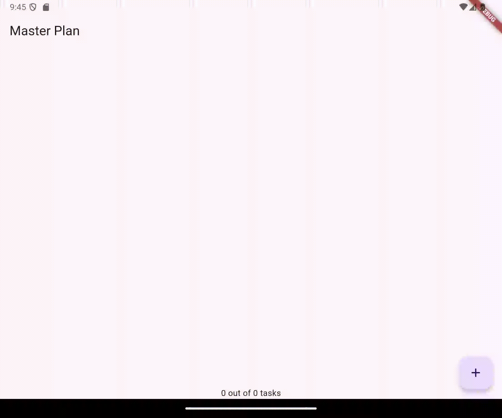
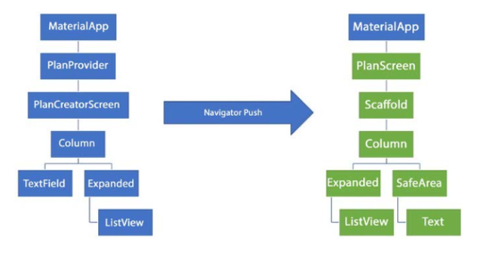
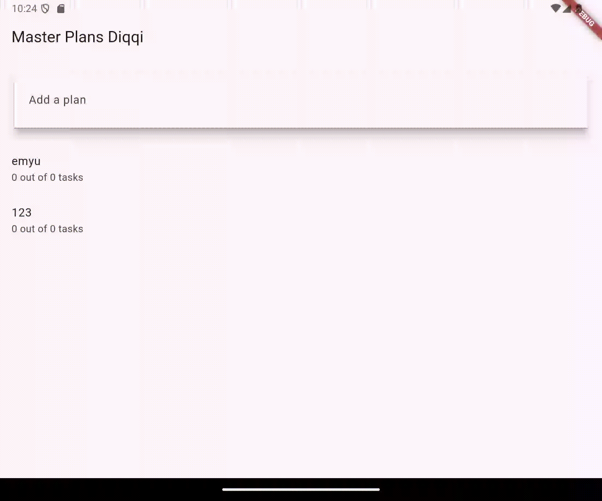

Nama    : Fatriya Ibnu Ash shidiqqi

Kelas   : TI - 3B

NIM     : 2241720138

## 10| Dasar State Management

##  Tugas Praktikum 1: Dasar State dengan Model-View
1. Selesaikan langkah-langkah praktikum tersebut, lalu dokumentasikan berupa GIF hasil akhir praktikum beserta penjelasannya di file README.md! Jika Anda menemukan ada yang error atau tidak berjalan dengan baik, silakan diperbaiki.  
2. Jelaskan maksud dari langkah 4 pada praktikum tersebut! Mengapa dilakukan demikian?  
Untuk mengekspor model dari file plan.dart dan task.dart sehingga akan mempersingkat porses impor dari kedua file tersebut
3. Mengapa perlu variabel plan di langkah 6 pada praktikum tersebut? Mengapa dibuat konstanta ?  
Pentingnya Variabel plan:  
Variabel plan tampaknya mewakili data yang akan digunakan dalam tampilan PlanScreen ini. Kelas Plan mungkin menyimpan informasi atau tugas-tugas yang perlu ditampilkan pada layar (seperti data dalam master plan), sehingga keberadaan variabel ini penting untuk akses data di seluruh tampilan.  
Mengapa Dibuat Konstanta (const):  
Kata kunci const pada Plan digunakan untuk membuat objek ini menjadi immutable atau tidak bisa diubah setelah inisialisasi. Ini sering dilakukan jika data yang diinisialisasi bersifat statis atau tidak perlu diubah selama runtime.

4. Lakukan capture hasil dari Langkah 9 berupa GIF, kemudian jelaskan apa yang telah Anda buat! 

5. Apa kegunaan method pada Langkah 11 dan 13 dalam lifecyle state ? 
initState():  
initState() adalah metode yang dipanggil sekali, saat state widget pertama kali diinisialisasi. Pada kode ini, initState() digunakan untuk membuat dan menginisialisasi objek scrollController dengan sebuah ScrollController(). scrollController memungkinkan kontrol dan pengaturan properti tampilan yang bisa di-scroll.  
dispose():  
dispose() adalah metode yang dipanggil saat state widget dihapus secara permanen dari widget tree. Fungsi ini digunakan untuk membersihkan atau membuang sumber daya yang dipakai oleh widget agar tidak terjadi memory leak. Pada kode ini, scrollController.dispose() dipanggil untuk menghapus scrollController dan membebaskan sumber daya yang digunakannya. Ini penting karena ScrollController mengelola elemen-elemen yang bisa menghabiskan memori jika tidak di-dispose dengan benar.

6. Kumpulkan laporan praktikum Anda berupa link commit atau repository GitHub ke spreadsheet yang telah disediakan! 

##  Tugas Praktikum 2: InheritedWidget
1. Selesaikan langkah-langkah praktikum tersebut, lalu dokumentasikan berupa GIF hasil akhir praktikum beserta penjelasannya di file README.md! Jika Anda menemukan ada yang error atau tidak berjalan dengan baik, silakan diperbaiki sesuai dengan tujuan aplikasi tersebut dibuat.  
2. Jelaskan mana yang dimaksud InheritedWidget pada langkah 1 tersebut! Mengapa yang digunakan InheritedNotifier?  
- return context.
    dependOnInheritedWidgetOfExactType<PlanProvider>()!.notifier!;  
- Penggunaan InheritedNotifier memiliki beberapa keuntungan salah satunya adalah Efisiensi Notifikasi Perubahan. InheritedNotifier menggunakan ValueNotifier sebagai notifier untuk memonitor perubahan dalam objek Plan. Ketika nilai dalam ValueNotifier berubah, InheritedNotifier akan secara otomatis memberi tahu widget di bawahnya yang menggunakan PlanProvider.of(context).

3. Jelaskan maksud dari method di langkah 3 pada praktikum tersebut! Mengapa dilakukan demikian?  
- get completedCount :   
 Getter completedCount berfungsi untuk menghitung dan mengembalikan jumlah tugas yang telah selesai dari daftar tasks. Dengan membuat getter ini, kita bisa menghitung jumlah tugas selesai kapan pun dibutuhkan tanpa perlu melakukan perulangan manual atau menulis logika ini berulang kali. Setiap kali completedCount dipanggil, nilai terbaru dari tugas yang selesai akan diambil dari daftar tasks secara otomatis.  

- Getter completenessMessage :
Getter completenessMessage berfungsi untuk mengembalikan string yang memberikan informasi mengenai jumlah tugas yang selesai dari total jumlah tugas. Getter ini membantu menghasilkan pesan kemajuan yang dinamis. Setiap kali daftar tasks diperbarui, nilai completenessMessage juga otomatis diperbarui, memberi informasi terkini tanpa perlu menghitung ulang atau membuat pesan ini di banyak tempat dalam kode.  

4. Lakukan capture hasil dari Langkah 9 berupa GIF, kemudian jelaskan apa yang telah Anda buat!  

5. Kumpulkan laporan praktikum Anda berupa link commit atau repository GitHub ke spreadsheet yang telah disediakan!  

##  Tugas Praktikum 3: State di Multiple Screens
1. Selesaikan langkah-langkah praktikum tersebut, lalu dokumentasikan berupa GIF hasil akhir praktikum beserta penjelasannya di file README.md! Jika Anda menemukan ada yang error atau tidak berjalan dengan baik, silakan diperbaiki sesuai dengan tujuan aplikasi tersebut dibuat.
2. Berdasarkan Praktikum 3 yang telah Anda lakukan, jelaskan maksud dari gambar diagram berikut ini!  

3. Lakukan capture hasil dari Langkah 14 berupa GIF, kemudian jelaskan apa yang telah Anda buat!

4. Kumpulkan laporan praktikum Anda berupa link commit atau repository GitHub ke spreadsheet yang telah disediakan!